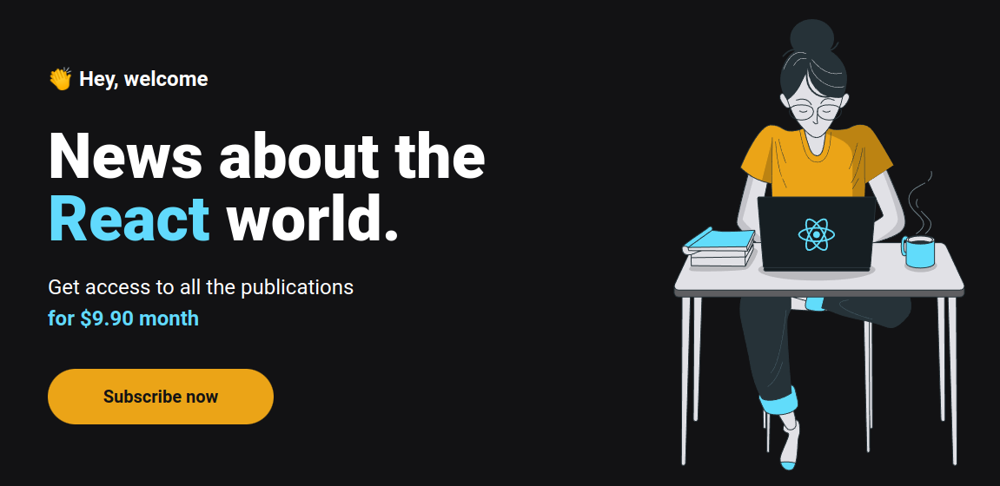

# Ignews 🚀

<center >
 
</center>

## Sobre o projeto:

### 🚧 Em construção 🚧

Aplicação de assinatura de conteúdo, utilizando as segintes tecnologias:

- NextJS
- Faunadb
- SASS
- Stripe

## Getting Started

First, run the development server:

```bash
npm run dev
# or
yarn dev
```

Open [http://localhost:3000](http://localhost:3000) with your browser to see the result.
